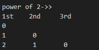

<h1><a href="https://www.geeksforgeeks.org/problems/decimal-equivalent-of-binary-linked-list/1" target="_blank">Decimal Equivalent of binary Linked List</a></h1>

```cpp

 long long MOD=1000000007;
        long long unsigned int decimalValue(Node *head)
        {
           // Your Code Here
           long long unsigned int ans =0;
           Node* start=head;
           
           while(start!=NULL)
           {
               ans=(ans*2 + start->data)%MOD;
               start=start->next;
           }
           
           return ans;
        }
```
here as we dont know the size of linked list, so, each moment when we are on node , we are asssuming that it is final/last node, then we the next node is present we simply multiply 2 with the previous node
](image.png)


### Note

1. Unable to for the approach in which we push the data in vector then, through travsling simply ans can calculated, HERE VECTOR IS UNDEFINED

2. cannot use the pow method 

thats why reversing of the linked list or calculating of size is that possible
