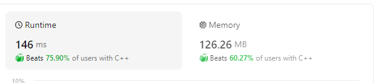

<h1><a href="https://leetcode.com/problems/rearrange-array-elements-by-sign/">Rearrange Array Elements by Sign</a></h1>

## Method 1

```cpp
vector<int> rearrangeArray(vector<int>& nums) {
        vector<int>posi;
        vector<int>neg;

        for(int i=0;i<nums.size();i++)
        {
            if(nums[i]>=0)
                posi.push_back(nums[i]);
            else
                neg.push_back(nums[i]);
        }

        vector<int>ans;

        int pi=0;
        while(pi!=posi.size())
        {
            ans.push_back(posi[pi]);
            ans.push_back(neg[pi]);

            pi++;
        }

        return ans;
    }

```

## Method 2 (Using 2 pointers)




```cpp
vector<int> rearrangeArray(vector<int>& nums) {
        
        vector<int>ans(nums.size(),0);

        int pos=0,neg=1;

        for(int i=0;i<nums.size();i++)
        {
            if(nums[i]>=0)
            {
                ans[pos]=nums[i];
                pos+=2;
            }
            else
            {
                ans[neg]=nums[i];
                neg+=2;
            }
        }

        return ans;
    }
```